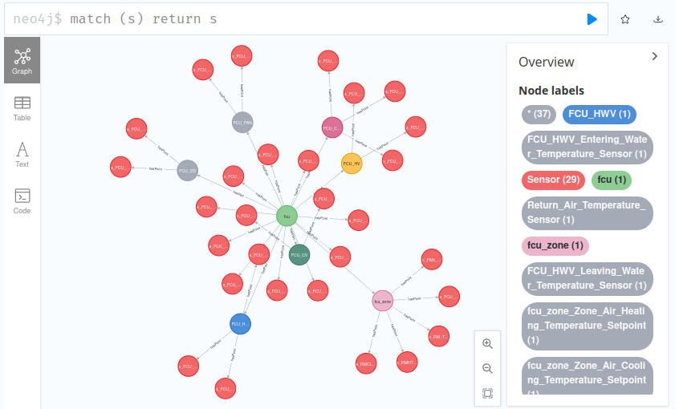
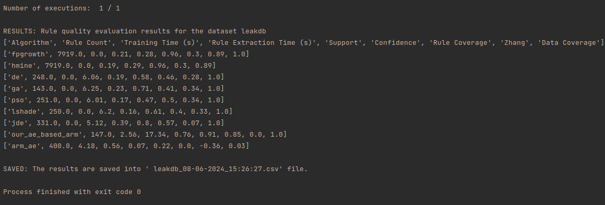

# Semantic Association Rule Learning

-------

## About

This repository consists of a set of semantic association rule learning approaches from time series data and knowledge
graphs, which are listed below:

- AutoEncoder-based SEMantic Association Rule Learning [reference hidden for anonymity]
- Naive SEMantic Association Rule Learning (Naive SemRL) [2]
- Optimization-based Semantic Association Rule Learning, based on Harris' Hawks Optimization [3]

## Code Structure

The time series data is stored inside a [TimescaleDB](https://www.timescale.com/) instance, while the
knowledge graph is stored inside a [Neo4j](https://neo4j.com/) database instance. The folder
named [semantic_rule_learning](semantic_rule_learning)
contains the source code for all of the three semantic association rule learning algorithms, namely Naive SemRL, HHO,
and AE SemRL.

### List of modules

- **data**: contains semantic part of 3 datasets namely LeakDB [1] and L-Town [6] from water networks domain
  and LBNL [7] from energy domain. It also contains sensor data for LeakDB dataset. The sensor data for the other 2
  datasets are not included in this folder as they occupy too much space. However, they can be found following the
  references.
- **graphdb**: contains a Neo4j implementation together with 3 Python scripts that are used to
  create
  a knowledge graph per dataset.
- **timescaledb**: a TimescaleDB implementation together with Python scripts that stores
  sensor data from each dataset in a different table
- **semantic_rule_learning**: a python application that creates semantic association rules
  from a given transaction dataset and knowledge graph

## Datasets

- LeakDB [1]: is an artificially generated realistic dataset for leak detection in water distribution networks. It
  contains time series data from 96 sensors of various types, as well as semantic information such as the formation of
  the network, sensor placement, and properties of network components, i.e., pipes and junctions
- L-Town [6]: is another dataset in the water distribution networks with same characteristics. It
  contains 118 sensors and associated semantics.
- LBNL [7]: is a Fault Detection and Diagnostics Dataset that contains both time series data from 29 sensors and
  semantics for Heating, Ventilation, and Air Conditioning (HVAC) systems such as the placement of the sensors and
  structure of the HVAC system.

## How to Run?

1) **Create a Neo4j graph database instance.** Run the [start_graphdb.sh](graphdb/start_graphdb.sh) script inside
   `graphdb` module to create an instance of Neo4j graph database. You can set a default username and password by
   changing
   the `NEO4J_AUTH` variable, for instance, `NEO4J_AUTH=neo4j/password`.
2) **Create knowledge graphs.** The [main.py](graphdb/src/main.py) file in the `graphdb` module is used to import
   semantic properties (metadata) of the two water distribution networks dataset into the graphdb, as a knowledge graph.
   Navigate to `graphdb` module on your terminal and install requirements using the following
   command `pip3 install -r requirements.txt`. Update the `file_name` variable inside this Python script to point out to
   a specific metadata file, e.g., `LeakDB_Hanoi_CMH_Scenario-1.inp`. Then rename
   the [.env_example](graphdb/.env_example) to `.env`, set environment variables for the graphdb, including its IP
   address, username and password. Then run the `main.py` script, e.g., `python3 main.py`. You can go
   to `http://localhost:7474/browser/` on your browser and run the following query to check if the knowledge graph is
   created properly `match (s) return s`:
   
3) **Import timeseries data.** Run [start_timescaledb.sh](timescaledb/start_timescaledb.sh) under the `timescaledb`
   module to create a TimescaleDB instance. Navigate to `timescaledb` module on your terminal and install requirements
   using the following command `pip3 install -r requirements.txt`. There are 3 Python scripts under the same module to
   import sensor data for each of the datasets. Change database IP address and credentials in each file,
   e.g., [import_leakdb_sensor_data.py](timescaledb/import_leakdb_sensor_data.py). Run, for
   instance, [import_leakdb_sensor_data.py](timescaledb/import_leakdb_sensor_data.py) to
   import sensor data into timescaledb, within a table named `leakdb`.
4) ** Learn semantic association rules.** Navigate to `semantic_rule_learning` module on your terminal and install
   requirements using the following command `pip3 install -r requirements.txt`. Change the name
   of [.env_example](semantic_rule_learning/.env_example) under `semantic_rule_learning` module to `.env`. Set
   environment variables for the graph and time series database in `.env`, such as IP addresses, usernames and
   passwords. To configure parameters for each of the algorithms, go to [main.py](semantic_rule_learning/src/main.py),
   and see the parameters at the beginning of the file. After setting the configurable algorithmic parameters, run
   the `main.py` script, e.g., `python3 main.py`. Example output:
   

## How to Reuse?

The source code for AE SemRL is given in the [ae_semrl.py](semantic_rule_learning/src/algorithm/ae_semrl.py) file. The
file contains a method called `create_input_vectors()` which receives a knowledge graph in the form
of [NetworkX](https://networkx.org/) graphs, and a transaction set in the form of array of arrays where each array
contains items for a transaction. `generate_rules()` method is called to generate a set of semantic association rules.
You can copy this file to your own codebase to use it as described.

A denoising Autoencoder implementation is given in [autoencoder](semantic_rule_learning/src/model/autoencoder.py) file.
It is a generic denoising Autoencoder implementation that has 3 layers for encoder and decoder each. The dimension of
each layer is 4 times smaller than the previous layer, hence an under-complete Autoencoder. You can copy this file to
your code base to use it as part of AE SemRL or create your own Autoencoder implementation, and call it inside `train()`
method of [ae_semrl.py](semantic_rule_learning/src/algorithm/ae_semrl.py).

### References:

1. Vrachimis, Stelios G., and Marios S. Kyriakou. "LeakDB: a Benchmark Dataset for Leakage Diagnosis in Water
   Distribution Networks:(146)." WDSA/CCWI Joint Conference Proceedings. Vol. 1. 2018.
2. Karabulut, Erkan, Victoria Degeler, and Paul Groth. "Semantic Association Rule Learning from Time Series Data and
   Knowledge Graphs." arXiv preprint arXiv:2310.07348 (2023).
3. Heidari, Ali Asghar, et al. "Harris hawks optimization: Algorithm and applications." Future generation computer
   systems 97 (2019): 849-872.
4. Stupan, Žiga, and Iztok Fister. "Niaarm: a minimalistic framework for numerical association rule mining." Journal of
   Open Source Software 7.77 (2022): 4448.
5. Vrbančič, Grega, et al. "NiaPy: Python microframework for building nature-inspired algorithms." Journal of Open
   Source Software 3.23 (2018): 613.
6. Vrachimis, S., Eliades, D., Taormina, R., Ostfeld, A., Kapelan, Z., Liu, S., Kyriakou, M., Pavlou, P., Qiu, M.,
   Polycarpou, M.: Dataset of battledim: Battle of the leakage detection and isolation methods. In: Proc., 2nd Int
   CCWI/WDSA Joint Conf. Kingston, ON, Canada: Queen’s Univ (2020).
7. Granderson, J., Lin, G., Chen, Y., Casillas, A., Im, P., Jung, S., Benne, K.,
   Ling, J., Gorthala, R., Wen, J., Chen, Z., Huang, S., , Vrabie, D.: Lbnl fault
   detection and diagnostics datasets (08 2022). https://doi.org/10.25984/1881324,
   https://data.openei.org/submissions/5763

### Contact

Please send an email to the following address for your feedback and questions: [email is hidden for anonymity]